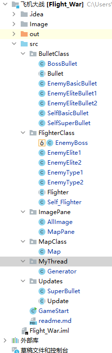

# Flight War 飞机大战
## 功能分析
### 自顶向下设计
1. 完整的游戏界面  
~~~
采用JavaFX来实现GUI
~~~
2. 完整的游戏过程
~~~
设计开始和结束界面
使用Java多线程来实现飞机控制
~~~
3. 丰富的战斗场景
~~~
设计了
普通怪两种
精英怪两种
boss攻击模式三种
玩家攻击模式两种
~~~
## 类简介

### BulletClass、
内含7个类
1. 抽象类Bullet  
记录bullet的基本信息
2. 普通怪一种子弹类  
EnemyBasicBullet
3. 精英怪两种子弹类  
EnemyEliteBullet1  
EnemyEliteBullet2
4. 玩家飞机两种子弹类  
SelfSuperBullet  
SelfBasicBullet
### FlighterClass
内含7个类
1. 抽象类Flighter  
记录飞机基本信息
2. EnemyBoss类  
Boss的行为
3. 精英怪的两个类  
   EnemyElite1 射线  
   EnemyElite2 跟踪导弹
4. 普通怪两个类  
   EnemyBasic1 普通  
   EnemyBasic2 自杀式攻击
5. 玩家飞机类  
SelfFlighter
### ImagePane
1. Allimage类  
管理所有的贴图
2. MapPane类  
主程序
### MapClass
1. Map  
主界面的封装
### MyThread
### Updates
### GameStart
